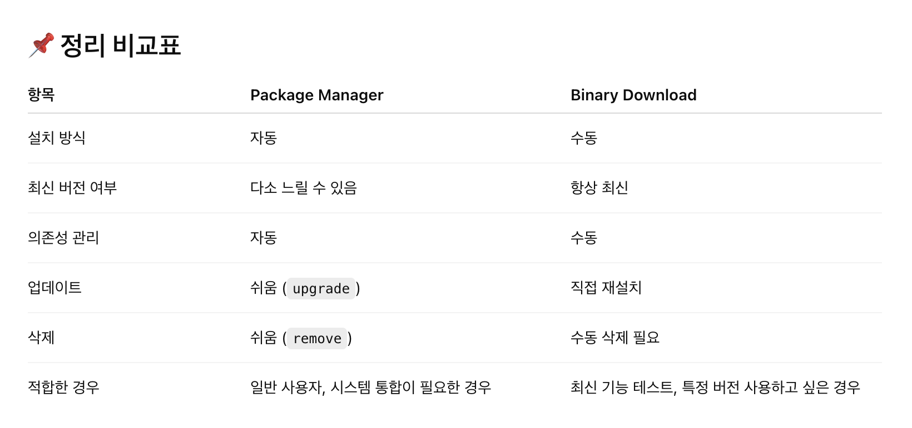

# Package manager, Binary download

### 1. Package Manager로 설치

#### 예시

* macOS: `brew install vagrant`
* Ubuntu: `apt install vagrant`
* Fedora: `dnf install vagrant`
* Windows: `choco install vagrant`

#### 개념

운영체제에 따라 제공되는 **패키지 관리 도구(package manager)** 를 통해 설치하는 방식이야.

#### 특징

* **자동 의존성 관리**: 필요한 라이브러리나 다른 소프트웨어도 같이 설치해줘.
* **업데이트 쉬움**: `brew upgrade`, `apt upgrade` 같은 명령으로 쉽게 최신 버전으로 업데이트 가능.
* **시스템 통합**: 설치된 위치, 설정 파일 등이 운영체제의 표준 위치에 맞게 구성됨.
* **더 안전함**: 대부분 공식 저장소나 신뢰할 수 있는 저장소를 통해 설치돼서 보안적으로 더 안전.

#### 장점

* 설치/업데이트/삭제가 간편함.
* 운영체제 환경과 잘 통합됨.
* 여러 명령어로 버전 확인, 롤백, 재설치 등이 쉬움.

#### 단점

* 최신 버전이 아닐 수도 있음 (패키지 관리자가 업데이트를 반영하기까지 시간 걸림).
* 가끔 Vagrant 공식 사이트에서 제공하는 기능보다 조금 제한적일 수 있음.

***

### 2. Binary Download (수동 설치)

#### 예시

* https://www.vagrantup.com/downloads 에서 `.zip` 또는 `.msi`, `.dmg` 등을 직접 다운로드

#### 개념

Vagrant 공식 홈페이지에서 **실행 파일(binary)** 을 직접 다운로드해서 수동으로 설치하는 방식이야.

#### 특징

* **공식 최신 버전 제공**: 항상 최신 버전의 파일이 올라와 있음.
* **직접 설치**: 압축 풀고 환경변수(PATH) 설정하는 등 수작업이 필요할 수 있음.
* **운영체제와 덜 통합됨**: 설정 파일 위치나 관리 방식이 시스템 패키지와 별도로 돌아갈 수 있음.

#### 장점

* 최신 기능을 바로 써볼 수 있음.
* 버전 선택의 자유로움 (이전 버전도 직접 선택 가능).

#### 단점

* 수동 설치, 수동 삭제 등 불편함.
* 업데이트나 보안 패치 등을 자동으로 반영해주지 않음.
* 시스템 통합이나 버전 관리가 까다로울 수 있음.

***

<figure><figcaption></figcaption></figure>

package Manager 압승
